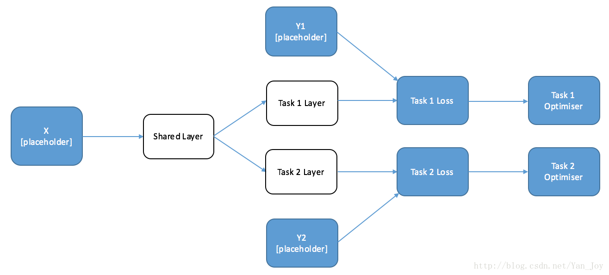
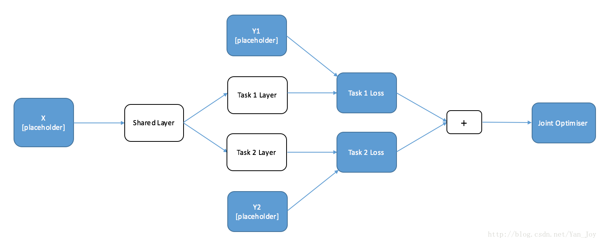
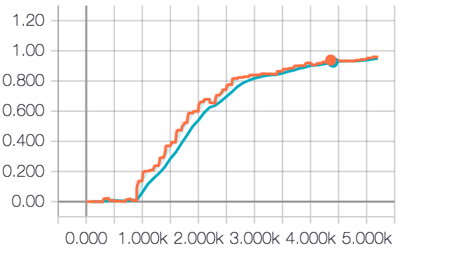
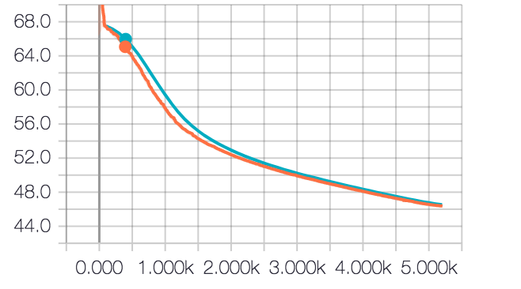

- 本项目主要用于识别验证码
    - 可以识别的验证码如下图所示：
        - 
- 思路
    - 之前在网上寻找这方面的资料，总结下来做图像分隔一共就三种思路
        - 利用传统过的图像分隔的方法，先将整个图片分隔成许多的字部分，然后再对每一个子部分进行识别
        - 直接深度学习的方法来进行识别，在这里也就是相当于分类问题，每个图片的label都是一个向量
        - 第三种方法和上面的第二种方法比较类似，只不过这种方法将整个的分类问题拆分成了多任务的分类问题。
    - 接下来我们详细介绍一下第二种和第三种方法，因为我尝试实现了这两种方法。
        - 方法二：
            - 这种方法和普通的图像分类并没有太大的区别，在这里我们就只要把验证码转化成一个向量就可以了，
            比如说我们验证码的每个字母由{0-9, a-z}构成，那么我们每个字母代表的纬度就是36纬的向量，我们验证码由4个字母构成，
            那么我们总的纬度就是36*4 = 144
            - 在指定loss函数的时候，我们不能指定softmax，应该我们这里的label其实是有多个1的，softmax是
            适用于one hot编码格式的label只有一个1的。因为它会将所有的概率归一化，所以这里它不适用。
            - 那我们用什么作为loss的预处理呢？loss肯定是交叉熵，但是我们要对logits先做一些操作，将其转化到0-1之前，代表概率。
            之前在网上看到这篇[文章](http://blog.csdn.net/huplion/article/details/72490467)，适用的sigmod函数。不过我尝试了，
            网络一直收敛不了，所以最后我也没有使用这种方法。
        - 方法三：
            - 在这种方法里，我们将该问题改成多目标多分类问题。由于我们验证码里面的字符个数是固定的---4个，所以我们的目标也就有四个。
            - 4个目标就对应的4个损失函数，那么我们应该怎么训练整个网络呢？一般来说，训练多目标网络有两种方法：
                - 交替训练：顾名思义，就是对每一个loss，我们都定义一个optimizer，我们依次对每一个optimizer进行优化。它的结构图如下所示：
                
                - 联合训练：在这里我们将四个loss函数组合成一个loss函数，在我们的实验中，我们只是将其简单的相加，怎么组成一个loss函数，根据我们项目背景而定。
                然后我们只需要定义一个优化器optimizer即可。用整个的optimizer去优化我们的loss。其结构图如下所示：
                
            - 至于我们怎么在两者中选择，一般来说
                - 交替训练容易对某一类产生偏向，当对于相同数据集，产生不同属性的输出时，保持任务的独立性，使用联合训练较好。也就是说，当我们多目标任务中的目标是毫无关系的时候，我们就可以使用交替训练。
                比如说我们需要在一副图例给一朵花分类的同时还需要给一条狗分品种，那么我们就可以认为这两个任务是独立的。所以我们使用交替训练。
                - 反而言之，我们就需要用联合训练：当我们的多任务目标中的每个任务目标之间都是有关系的，比如说我们的验证码识别，每个验证的字母都会出现在同一个集合中，所以这就是有关系的，不算独立的。
            - [参考博客](http://blog.csdn.net/yan_joy/article/details/62235704)
    - 最后实验我们选择了方法三，因为使用方法二一直不收敛，讲道理两者应该是通的，具体原因还需要查证。
    - 忘了说，我们分类网络用的是ResNet50
    - acc曲线：
    
    - loss曲线：
    